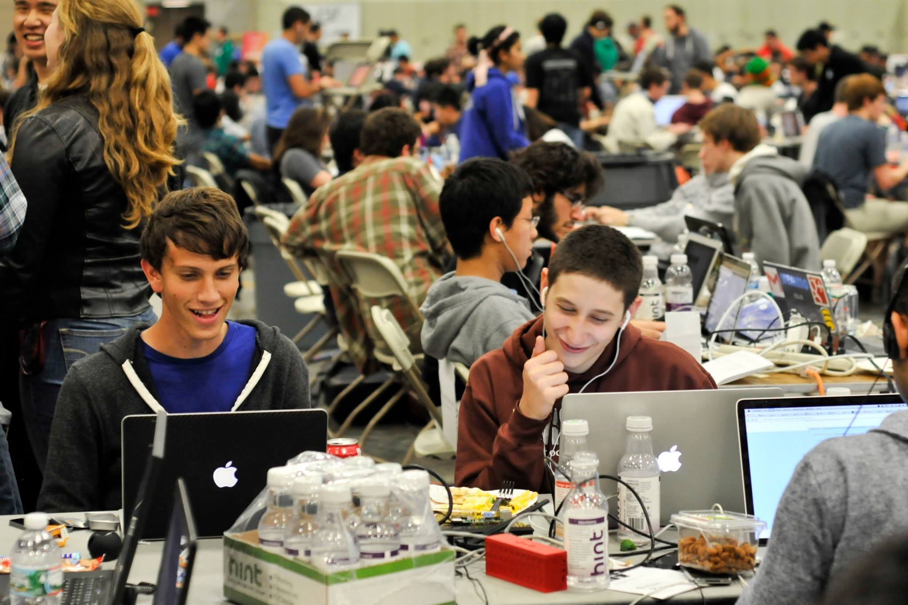

## Third Place

Our team at HackMIT won **third place** with our app **PiVision**. PiVision allows users to record and stream live TV from a cable source to their iOS device using a Raspberry Pi.

**Left to Right:** Me, Ari Weinstein
